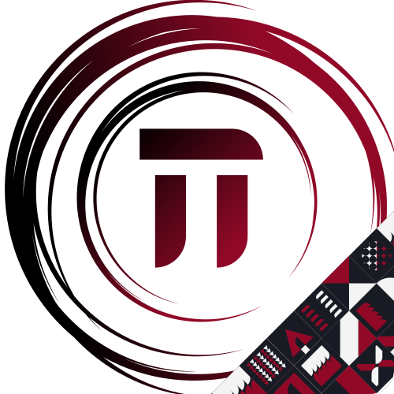

<h1>
  
  🔺Treinamento Técnico 2023.2🔺
</h1>

Este repositório é dedicado ao projeto construído pelos intrutores desenvolvedores do Treinamento Técnico de 2023.2 ofertado pela EJCM🏯.
O projeto desenvolvido neste treinamento foi o **Gakalu Games**, que por sua vez foi criado no treinamento técnico passado por um time de Designers
e suas informações são descritas mais abaixo.

### 🔗Links
- [Protótipo no Figma](https://www.figma.com/file/Z5Bh85ts1NvzFhxaHeWfPJ/Untitled?type=design&node-id=0%3A1&mode=design&t=8v0iZgj5piuSIZw8-1)

<br/>
<br/>

## 🔺Sobre o Projetoℹ️🔺
### Prototipagem
O protótipo do projeto foi feito de forma incremental durante as aulas do ***Processo Seletivo de Design*** assim como a implementação foi feita durante
as aulas do ***Processo Seletivo de Desenvolvedor***

## 🔺Desenvolvimento⚙️🔺
O projeto consiste numa aplicação feita em ReactJS
a base de Typescript, e abrange a maior
parte dos conceitos de desenvolvimento Web e do framework em si e da linguagem utilizada, tais como **Componentização**, **Data Binding**, **Formulários**
**Rotas**, **API REST**, **Hooks**, **Controllers**, **Models**, **Modelagem BD** etc.
<br/>
<br/>

# Instruções
## Dependência de Desenvolvedor


Após clonar o repositório ou, caso já tenha clonado, atualize-o com
```
- git fetch
- git pull origin main
```
Feito isso, para instalar todas as dependências do seu projeto
